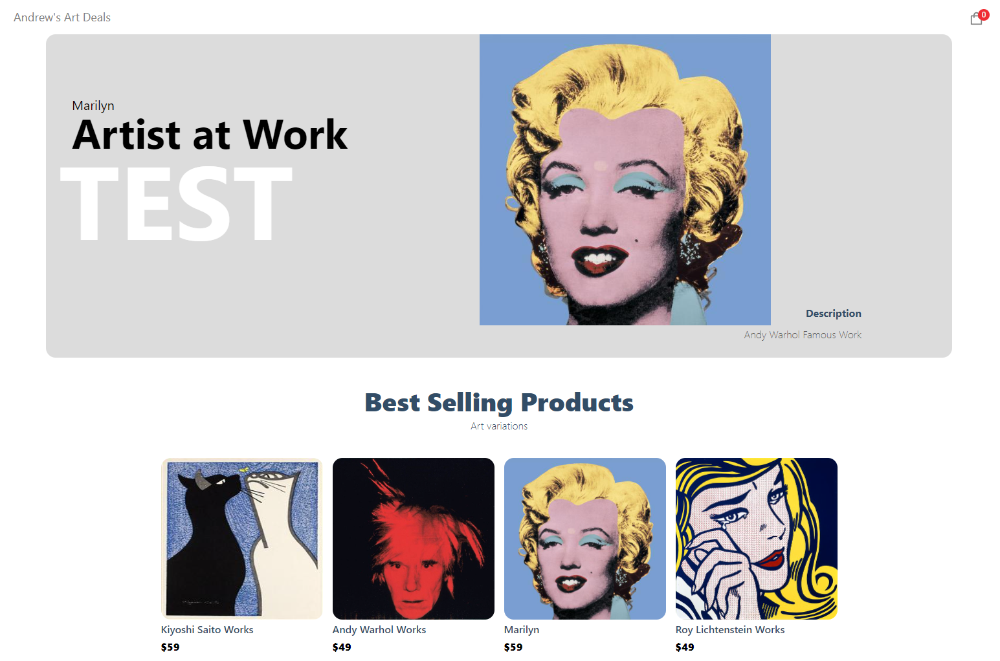
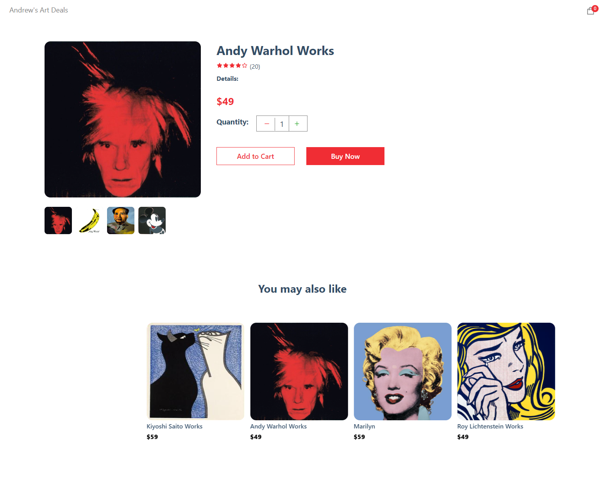
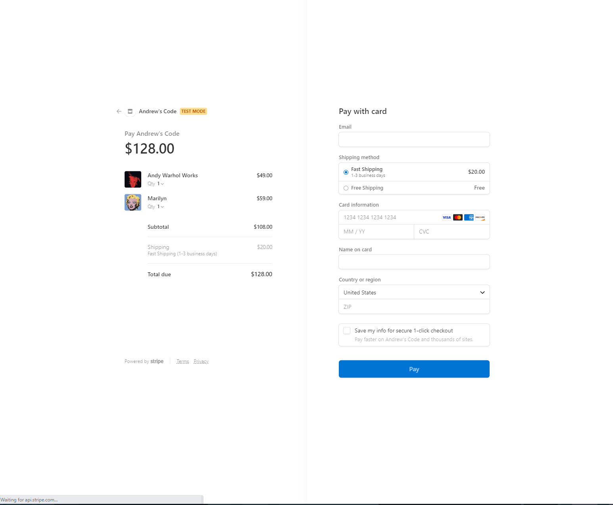

This is a self-motivated project that aims to fortifiy my ability to produce a modern full stack Ecommerce application with stripe and sanity.

In this project, I have learned and practiced:
1. Advanced React practices such as folder and file structure, as well as hooks and refs.
2. Advanced State Management of the entire application using React Context API.
3. Next.js practices such as use Next.js as a backend endpoint, file-based routing, Data fetching that allows server-side rendering and static generation. 
4. Integrate Stripe to manage payments, products, shipping rates and the checkout process.
5. Manage the content of my web app using Sanity.

With Sanity, both my future client and I will be able to acess Sanity as a unified content platform which makes the web application scalable and easy to adminstrate. 

Here are some screen shots from the site:

